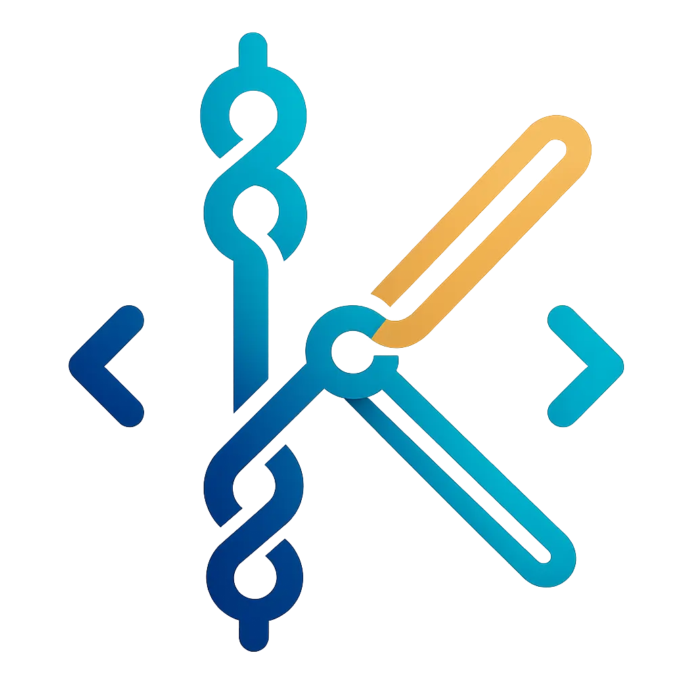
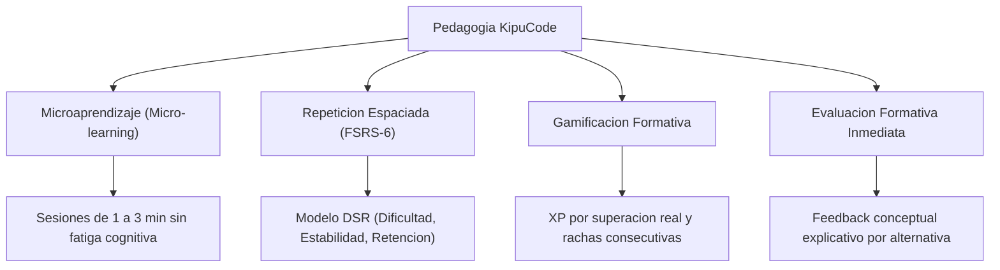
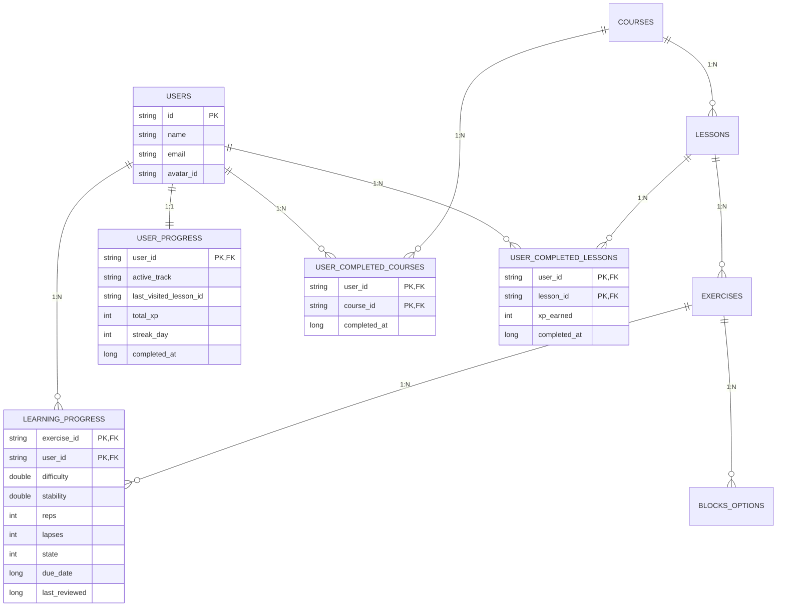

# KipuCode

<p align="center">
  
</p>

<p align="center">
  <strong>Decodificando el Pasado. Programando el Futuro.</strong><br>
  <em>Aplicación móvil de aprendizaje interactivo y adaptativo para la enseñanza moderna de fundamentos de programación e ingeniería de software.</em>
</p>

<p align="center">
  
  
  
  
  
  
</p>

---

## 1. Propósito Educativo y Visión del Proyecto

### ¿Qué es KipuCode?
**KipuCode** es una plataforma educativa móvil diseñada para transformar la experiencia de aprender a programar. Inspirada en la sabiduría de los *quipus* andinos, sistemas ancestrales de registro y transmisión de información mediante nudos y patrones lógicos, la aplicación busca que los estudiantes desarrollen habilidades técnicas sólidas de programación a través de **microaprendizaje estructurado, retroalimentación inmediata y retención cognitiva a largo plazo**.

### Público Objetivo
* **Estudiantes universitarios de ingeniería y computación** cursando asignaturas iniciales (Fundamentos de Programación, Programación Orientada a Objetos, Algoritmos).
* **Ingresantes a carreras tecnológicas e institutos técnicos** que requieren nivelación lógica y práctica antes de enfrentarse a entornos de desarrollo complejos.
* **Autodidactas y entusiastas** que buscan una ruta de aprendizaje guiada, sin curvas de frustración abruptas ni metodologías pasivas.

### Problemática que Resuelve
La enseñanza tradicional de programación suele generar altas tasas de reprobación y deserción temprana debido a:
1. **Brecha entre teoría y práctica:** Clases magistrales expositivas sin suficiente ejercitación interactiva inmediata.
2. **Curva del olvido:** Los conceptos vistos en semanas iniciales (variables, condicionales, ciclos) se olvidan rápidamente al avanzar el semestre por falta de refuerzo espaciado.
3. **Frustración y fatiga cognitiva:** Ejercicios extensos y lineales que bloquean el avance del alumno ante un solo error, sin explicaciones formativas claras.

KipuCode supera estas barreras proporcionando un ecosistema donde el estudiante practica en bloques breves de 1 a 3 minutos, recibe explicaciones pedagógicas al instante y refuerza sus debilidades mediante un motor inteligente de repetición espaciada.

---

## 2. Características Principales

* **Navegación Libre por Tracks (C# y Java):**
  * Desacoplamiento lineal completo: el estudiante puede navegar y explorar libremente cualquier lección o módulo del catálogo sin bloqueos pedagógicos forzados.
  * Marcador pasivo inteligente (*"Separador de libro"*): recuerda la última lección visitada para reanudar el estudio con un solo toque desde la pantalla principal.

* **Dominio Cognitivo en Tiempo Real (FSRS-6):**
  * Supera la métrica tradicional de *"X lecciones completadas"* reemplazándola por un porcentaje dinámico de **Retención y Dominio Cognitivo** impulsado por el algoritmo FSRS-6 (*Free Spaced Repetition Scheduler*).
  * Clasificación adaptativa del progreso: *Iniciando tema* ($0\% - 39\%$), *En consolidación* ($40\% - 79\%$) y *Maestría consolidada* ($80\% - 100\%$).

* **Microaprendizaje y Sesiones Ágiles:**
  * Teoría sintetizada y concisa complementada inmediatamente por dinámicas prácticas interactivas (selección única, opciones múltiples, bloques de código estructurados y análisis de terminal).
  * Sesiones ágiles configuradas para resolverse en cualquier momento y lugar desde el dispositivo móvil.

* **Gamificación Formativa y Escudo Anti-Farmeo:**
  * Sistema de Experiencia (XP) blindado por **Delta de Récord Histórico**: repetir una lección previamente aprobada no infla los puntos del usuario; solo se otorga XP adicional si el alumno supera su mejor puntaje anterior.
  * Rachas de estudio diarias (*Streak Counter*), historial semanal y avatares desbloqueables para fomentar la constancia de estudio.

* **Filosofía Offline-First Garantizada:**
  * Todo el catálogo de cursos, módulos, lecciones y opciones se encuentra almacenado y optimizado localmente en **SQLite (Room Database)**.
  * La aplicación funciona de manera fluida sin acceso a internet; los avances, XP y métricas de repetición espaciada se sincronizan automáticamente con **Cloud Firestore** cuando se restablece la conectividad.

* **Retroalimentación Formativa Inmediata:**
  * Cada opción o bloque de ejercicio incluye explicaciones didácticas contextuales (`explanation`), transformando el error en una oportunidad directa de aprendizaje conceptual.

---

## 3. Enfoque Pedagógico y Sustento Teórico

KipuCode no es simplemente una herramienta de evaluación; es un entorno educativo fundamentado en metodologías pedagógicas respaldadas por la ciencia cognitiva y las ciencias de la computación:

### Metodologías de Aprendizaje Aplicadas



1. **Microaprendizaje (*Micro-learning*):** Reducción de la sobrecarga de la memoria de trabajo mediante la fragmentación del conocimiento en lecciones nucleares y prácticas focalizadas.
2. **Repetición Espaciada Adaptativa (*Spaced Repetition* - FSRS-6):** Basado en el modelo matemático de tres componentes de la memoria (Dificultad, Estabilidad y Retención). El sistema programa repasos predictivos justo en el momento óptimo antes de que el concepto sea olvidado.
3. **Gamificación Formativa:** Incentivos intrínsecos y extrínsecos (puntos XP de calidad, niveles y rachas) alineados estrictamente con el dominio cognitivo, eliminando el farmeo artificial.
4. **Evaluación Formativa:** Respuestas acompañadas de justificaciones técnicas que guían al estudiante en la comprensión de *por qué* una alternativa es correcta o incorrecta.

---

### Fuentes Bibliográficas y Currículo de Referencia (Track C#)

El diseño curricular, la progresión pedagógica y el rigor técnico del track de C# en KipuCode se sustentan en las siguientes obras canónicas de la literatura especializada:

| Obra y Edición | Autor(es) | Contribución Pedagógica y Técnica en KipuCode |
| :--- | :--- | :--- |
| **The C# Player's Guide** | **RB Whitaker** | **Curva Didáctica y Gamificación:** Aporta la metáfora de progresión por niveles, misiones y desafíos prácticos. Inspira la transición amigable desde programas sencillos hasta lógica orientada a objetos sin abrumar con tecnicismos prematuros. |
| **C# Data Structures and Algorithms** | **Marcin Jamro, PhD** | **Rigor Algorítmico y Lógica Fundamental:** Base para la enseñanza de estructuras de datos lineales y no lineales, análisis de complejidad computacional (*Big-O*) y descomposición de problemas mediante pseudocódigo y diagramas de flujo. |
| **Programming C# 12 / 10** | **Ian Griffiths** | **Sintaxis Idiomática Moderna:** Fundamento para el aprendizaje de las características contemporáneas del lenguaje (instrucciones de nivel superior, constructores primarios, expresiones de colección, registros e inmutabilidad). |
| **C# 12 in a Nutshell** | **Joseph Albahari** | **Mapa Conceptual y Motor .NET:** Referencia para la comprensión profunda del Common Language Runtime (CLR), la BCL, gestión de memoria (Stack vs. Heap), recolección de basura (*GC*) y evaluación avanzada de tipos. |
| **Clean Code & The Clean Coder** | **Robert C. Martin ("Uncle Bob")** | **Disciplina Profesional y Calidad de Software:** Transmisión de principios SOLID, nombres expresivos, funciones pequeñas y mentalidad requerida para transformar código aficionado en software mantenible y profesional. |
| **C# Concurrency** | **Nir Dobovizki** | **Modelo Asíncrono:** Base pedagógica para introducir de forma clara y sin trampas el paradigma multihilo, `async/await`, el objeto `Task` y flujos asíncronos en .NET. |
| **Pro C# 10 with .NET 6** | **Andrew Troelsen & Phil Japikse** | **Desarrollo Aplicado y Ecosistema:** Conexión entre la teoría del lenguaje y la arquitectura de software real (APIs RESTful, persistencia con ORM y pruebas automatizadas). |

---

## 4. Stack Tecnológico

La aplicación está construida siguiendo los estándares recomendados por Google y la comunidad moderna de desarrollo en Android:

| Componente | Tecnología / Librería | Versión | Propósito |
| :--- | :--- | :--- | :--- |
| **Lenguaje Core** | Kotlin | `2.3.21` | Lenguaje oficial de desarrollo Android con null-safety estricto y corrutinas. |
| **Framework de UI** | Jetpack Compose (BOM) | `2026.05.00` | Construcción de interfaces declarativas, dinámicas y reactivas con Material Design 3. |
| **Navegación** | Navigation Compose | `2.9.8` | Navegación declarativa y type-safe con `@Serializable` (`kotlinx.serialization`). |
| **Inyección de Dependencias**| Dagger Hilt | `2.59.2` | Inyección de dependencias modular y desacoplada en ViewModels y Casos de Uso. |
| **Persistencia Local** | Room Database (SQLite) | `2.8.4` | Almacenamiento relacional local, transacciones atómicas y soporte offline-first. |
| **Persistencia Remota** | Cloud Firestore | BOM `34.13.0` | Base de datos NoSQL en la nube para sincronización del progreso de los usuarios. |
| **Autenticación** | Firebase Auth | BOM `34.13.0` | Gestión segura de credenciales, registro, inicio de sesión y recuperación de cuentas. |
| **Motor Cognitivo** | FSRS Core | `1.0.0` | Implementación nativa del algoritmo de repetición espaciada FSRS-6. |
| **Renderizado Markdown** | Multiplatform Markdown Renderer | N/A | Formateo enriquecido y resaltado de código en lecciones teóricas. |

---

## 5. Arquitectura de Software

KipuCode implementa **Clean Architecture** combinada con el patrón **Model-View-ViewModel (MVVM)** y **Flujo Unidireccional de Datos (UDF)**:

```text
┌─────────────────────────────────────────────────────────────┐
│                       UI / PRESENTATION                     │
│    Jetpack Compose Screens  ───►  StateFlow / ViewModels    │
└──────────────────────────────┬──────────────────────────────┘
                               │ Observa estados reactivos
┌──────────────────────────────▼──────────────────────────────┐
│                         DOMAIN LAYER                        │
│    UseCases (CognitiveMastery, Lesson, UserProgress, Auth)   │
│    Domain Models (UserDomain, CourseDomain, LessonDomain)   │
│    Repository Interfaces (Contracts)                        │
└──────────────────────────────▲──────────────────────────────┘
                               │ Implementa contratos
┌──────────────────────────────┴──────────────────────────────┐
│                          DATA LAYER                         │
│  Mappers (DTO ◄► Entity ◄► Domain)                          │
│  Repositories (Offline-First Sync Coordinators)              │
│  Local: Room DB (Entities & DAOs)                           │
│  Remote: Firebase Auth & Cloud Firestore                    │
└─────────────────────────────────────────────────────────────┘
```

### Modelo de Datos Normalizado (SQLite / Room)

El modelo relacional local de KipuCode garantiza una separación estricta en **Tercera Forma Normal (3FN)** con tablas intermedias $M:N$ para registrar lecciones, cursos y ejercicios evaluados:



---

## 6. Estructura del Proyecto

```text
app/src/main/java/com/kipucode/
├── data/
│   ├── local/               # Room Database, Entidades, DAOs y DatabaseSeedService
│   │   ├── dao/             # Acceso reactivo a SQLite (UserDao, CourseDao, ExerciseDao...)
│   │   ├── database/        # AppDatabase con Room migrations y TypeConverters
│   │   └── model/           # Entidades SQLite normalizadas (Users, Courses, Progress...)
│   ├── mapper/              # Transformaciones puras (Entity <-> DTO <-> Domain)
│   ├── remote/firebase/     # Data sources y DTOs para Cloud Firestore y Firebase Auth
│   └── repository/          # Implementaciones concretas de repositorios (Offline-First)
├── di/                      # Módulos de inyección de dependencias con Dagger Hilt
├── domain/
│   ├── model/               # Modelos de negocio inmutables libres de dependencias de Android
│   ├── repository/          # Interfaces y contratos abstractos de acceso a datos
│   └── usecase/             # Lógica de aplicación pura (FSRS Cognitive Mastery, Auth...)
├── ui/
│   ├── components/          # Componentes reutilizables (Botones, Cards, Dialogs, TopBar)
│   ├── navigation/          # AppNavigation con rutas Type-Safe de Navigation Compose
│   ├── screens/             # Vistas de la aplicación (Home, Explore, Lesson, Exercise, Profile)
│   └── theme/               # Paleta de colores, tipografías Nunito y temas Material 3
└── viewmodel/               # ViewModels reactivos con StateFlow y manejo de ciclo de vida
```

---

## 7. Instalación y Ejecución

### Requisitos Previos
* **Android Studio:** Ladybug (2024.2.1) o superior.
* **JDK:** Java Development Kit 17 o superior.
* **SDK Android:**
  * `compileSdk`: 35
  * `minSdk`: 26 (Android 8.0 Oreo o superior)
  * `targetSdk`: 35

### Pasos para Ejecutar
1. **Clonar el repositorio:**
   ```bash
   git clone https://github.com/juan-martin2005/KipuCode.git
   cd KipuCode
   ```

2. **Configuración de Firebase:**
   * Descargar el archivo `google-services.json` desde la consola de Firebase del proyecto.
   * Colocarlo en la ruta: `app/google-services.json`.

3. **Sincronizar y Compilar:**
   * Abrir el proyecto en Android Studio.
   * Ejecutar la sincronización de Gradle (*Sync Project with Gradle Files*).
   * Seleccionar un emulador o dispositivo físico con Android 8.0+ y presionar **Run (`Shift + F10`)**.

---

<p align="center">
  Diseñado y desarrollado con dedicación para el aprendizaje accesible y significativo del desarrollo de software.
</p>
